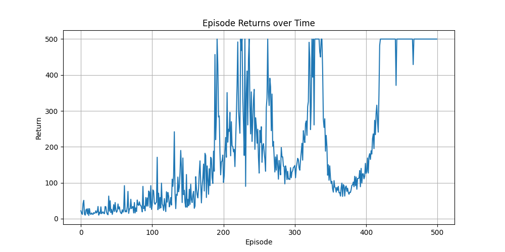

# Hands-on-RL

Étudiant : Axel Labrousse

## REINFORCE

Graph of the evolution of rewards over episodes : 

For the evaluation, we get a sucess rate of 100% over the 100 evaluations of the saved model.

## Stable-Baseline 3 and Hugging Face

Here is the link for the CartPole model trained with the A2C algorithm : [A2C model](https://huggingface.co/AxelLabrousse/a2c_cartpole)

## Weights and Biases

I could not make my runs public so I added a PDF report in the directory.

## Full workflow training

For the full training pipeline you can refer to the *ddpg_panda_reach.py* program. I did not manage to make the code work with the A2C algorithm with panda_gym.

I used the DDPG algorithm instead and I first trained the model on the PandaReachJointsDense-v3 environment for 500000. You can find the W&B report for this training in the *Report Run 2.pdf* file. We see that the total rate of sucess is dropping after 5000 timestamps of training. 

I then trained the model with the same algorithm but only for 5000 timestamps and the model seems to work really well during tests. The test are done with the *a2c_sb3_panda_reach_test.py* file and the model is the *ddpg_reachjointsdense2.zip*.

I do not really understand why the model suddendly drops in sucess after 5k timestamps but when testing the model trained for 500k timestamps it seems that the model is kind of stuck on one behaviour. Maybe the model overfits.

